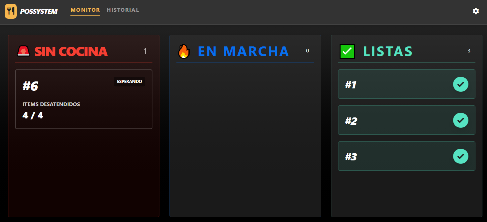
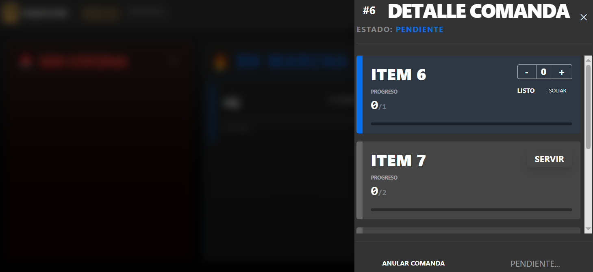
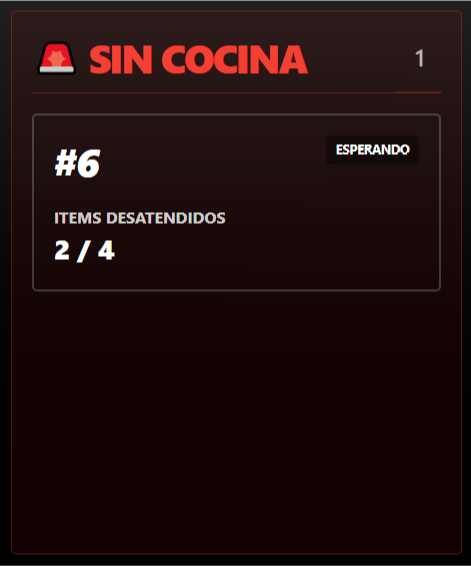
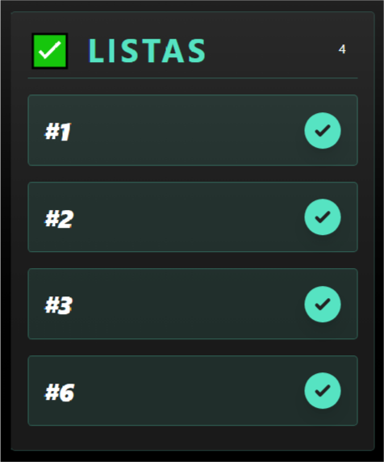

# 🍔 Sistema de Comandas para Cocina

## 📋 Descripción del Proyecto

**Sistema de Comandas** es una aplicación web en tiempo real diseñada para gestionar el flujo de pedidos en cocinas profesionales. Construido con **Svelte 5**, **SvelteKit**, **TypeScript**, **Tailwind CSS** y **Skeleton UI**, el sistema permite a los cocineros visualizar, reclamar, actualizar y completar comandas de manera eficiente mediante una interfaz moderna y reactiva.








### ✨ Características Principales

- **📊 Vista en 3 Columnas**: Organización visual clara de comandas según su estado
  - 🚨 **Sin Cocina**: Comandas pendientes sin asignar
  - 🔥 **En Marcha**: Comandas en preparación con progreso visual
  - ✅ **Listas**: Comandas completadas y listas para entregar

- **⚡ Actualización en Tiempo Real**: Sincronización mediante WebSockets (Socket.IO)
- **👨‍🍳 Gestión por Cocinero**: Sistema de exclusividad que permite reclamar productos
- **📈 Indicadores de Progreso**: Barras visuales y porcentajes de completitud
- **🎯 Modo Dual**: Funciona con backend real o datos de prueba (desarrollo)
- **📱 Diseño Responsive**: Optimizado para tablets y pantallas de cocina
- **🎨 UI Moderna**: Interfaz atractiva con animaciones y transiciones suaves

---

## 🏗️ Arquitectura del Proyecto

### Estructura de Directorios

```
cocina/
├── readme.md                    # Este archivo
└── comandas/                    # Aplicación SvelteKit
    ├── package.json             # Dependencias del proyecto
    ├── svelte.config.js         # Configuración de Svelte/SvelteKit
    ├── vite.config.ts           # Configuración de Vite
    ├── tsconfig.json            # Configuración TypeScript
    ├── eslint.config.js         # Configuración ESLint
    ├── .npmrc                   # Configuración NPM
    ├── src/
    │   ├── app.html             # Plantilla HTML base
    │   ├── app.d.ts             # Definiciones TypeScript globales
    │   ├── tailwind.config.ts   # Configuración Tailwind + Skeleton
    │   │
    │   ├── routes/              # Sistema de rutas de SvelteKit
    │   │   ├── +layout.svelte   # Layout principal con navegación
    │   │   ├── +page.svelte     # Página inicial (mínima)
    │   │   └── layout.css       # Estilos globales
    │   │
    │   ├── modulos/
    │   │   └── comandas/        # Módulo de gestión de comandas
    │   │       ├── api.ts       # Cliente HTTP y endpoints
    │   │       ├── service.ts   # Capa de servicios con validación
    │   │       ├── store.svelte.ts      # Estado reactivo (Svelte 5 runes)
    │   │       ├── vista.svelte         # Vista principal (3 columnas)
    │   │       ├── schema.zod.2.ts      # Schemas Zod y tipos
    │   │       └── components/
    │   │           ├── SinCocina.svelte    # Columna comandas críticas
    │   │           ├── EnMarcha.svelte     # Columna en preparación
    │   │           ├── Listas.svelte       # Columna completadas
    │   │           └── Productos.svelte    # Panel detalle comanda
    │   │
    │   └── lib/                 # Librerías compartidas
    │       ├── index.ts
    │       └── assets/
    │
    ├── static/                  # Archivos estáticos
    │   └── robots.txt
    │
    └── .svelte-kit/             # Archivos generados (no editar)
```

---

## 🛠️ Stack Tecnológico

### Frontend Framework
- **Svelte 5.49.2** - Framework reactivo con Runes (nueva API)
- **SvelteKit 2.50.2** - Framework de aplicaciones con SSG/SSR
- **TypeScript 5.9.3** - Tipado estático

### UI & Styling
- **Tailwind CSS 4.1.18** - Framework CSS utility-first
- **Skeleton UI 4.12.0** - Librería de componentes para Svelte
- **Lucide Icons** - Iconografía moderna
- **@tailwindcss/forms** - Estilos mejorados para formularios

### Validación & Comunicación
- **Zod 4.3.6** - Validación de esquemas y tipado
- **Socket.IO Client 4.8.3** - Cliente WebSocket para tiempo real

### Build Tools
- **Vite 7.3.1** - Bundler ultrarrápido
- **ESLint 9.39.2** - Linter de código
- **@sveltejs/adapter-static** - Adaptador para build estático

---

## 🚀 Instalación y Uso

### Prerrequisitos

- **Node.js** >= 18.x
- **npm** o **pnpm**

### Instalación

```bash
# Navegar al directorio del proyecto
cd cocina/comandas

# Instalar dependencias
npm install
```

### Comandos Disponibles

```bash
# Desarrollo - Servidor local con hot reload
npm run dev

# Desarrollo con navegador automático
npm run dev -- --open

# Build para producción
npm run build

# Preview de build de producción
npm run preview

# Validación de tipos TypeScript
npm run check

# Validación continua
npm run check:watch

# Linting
npm run lint
```

### Configuración del Backend

El sistema está configurado para detectar automáticamente el host:

```typescript
// En api.ts
const host = window.location.hostname; // localhost o 192.168.1.109
const apiUrl = `http://${host}:3000`;
```

**Modo Desarrollo (Sin Backend)**:
```typescript
// En +layout.svelte
await gestorCocina.inicializar(false); // Usa datos de prueba
```

**Modo Producción (Con Backend)**:
```typescript
await gestorCocina.inicializar(true); // Conecta a API real
```

---

## 📐 Arquitectura del Código

### 1. Sistema de Estado Reactivo (Svelte 5 Runes)

**`store.svelte.ts`** - Gestor centralizado con nueva API de Svelte 5:

```typescript
export class GestorCocina {
    #comandas = $state<Comanda[]>([]);           // Estado reactivo
    #idCocineroLogueado = $state<number | null>(null);
    #online = $state<boolean>(false);

    get todas() { return this.#comandas; }       // Getters reactivos
    get criticas() { return this.#comandas.filter(c => c.estado === 'SINCOCINA'); }
    get enMarcha() { return this.#comandas.filter(c => c.estado === 'PENDIENTE'); }
    get finalizadas() { return this.#comandas.filter(c => c.estado === 'FINALIZADA'); }
}
```

### 2. Capas de Abstracción

```
┌─────────────────────────────────────┐
│   Components (UI)                   │
│   SinCocina, EnMarcha, Productos    │
└──────────────┬──────────────────────┘
               │
┌──────────────▼──────────────────────┐
│   Store (Estado Reactivo)           │
│   gestorCocina - Svelte 5 Runes     │
└──────────────┬──────────────────────┘
               │
┌──────────────▼──────────────────────┐
│   Service (Validación)              │
│   serviceCocina - Zod Schemas       │
└──────────────┬──────────────────────┘
               │
┌──────────────▼──────────────────────┐
│   API (HTTP Client)                 │
│   CocinaAPI - Fetch Wrapper         │
└─────────────────────────────────────┘
```

### 3. Flujo de Datos

#### Sincronización en Tiempo Real

```typescript
// Socket.IO conecta automáticamente
socket.on('cocina_update', (payload: EventoComandaPayloadType) => {
    gestorCocina.procesarEvento(payload);
});
```

#### Tipos de Eventos WebSocket

```typescript
'NUEVA_COMANDA'         // Entrada desde ventas
'COMANDA_ACTUALIZADA'   // Cambio genérico
'PRODUCTO_COGER'        // Chef reclama ítem
'PRODUCTO_SOLTAR'       // Chef libera ítem
'PRODUCTO_SERVIDO'      // Incremento de cantidad
'COMANDA_FINALIZADA'    // Todos los productos listos
'COMANDA_ENTREGADA'     // Sale del monitor
'COMANDA_ELIMINADA'     // Anulada
```

---

## 🎨 Componentes Principales

### Vista Principal (`vista.svelte`)

```svelte
<ColumnaSinCocina comandas={gestorCocina.criticas} onSeleccionar={abrirComanda} />
<ColumnaEnMarcha comandas={gestorCocina.enMarcha} onSeleccionar={abrirComanda} />
<ColumnaListas comandas={gestorCocina.finalizadas} />
```

### Panel de Productos (`Productos.svelte`)

**Características**:
- Visualización de ítems individuales con progreso
- Botones contextuales según estado:
  - **SERVIR**: Reclama producto (rojo)
  - **+/-**: Ajusta cantidad servida
  - **LISTO**: Marca como completado
  - **SOLTAR**: Libera producto
- Sistema de exclusividad por cocinero
- Indicador visual de productos ocupados por otros

### Sistema de Estados

```typescript
export const EstadoComandaEnum = z.enum([
  'PENDIENTE',    // Sin cocinar
  'SINCOCINA',    // Crítico - sin cocinero asignado
  'FINALIZADA',   // Lista para entregar
  'ENTREGADA',    // Ya no se visualiza
  'ANULADA'       // Cancelada
]);
```

---

## 🔐 Validación con Zod

### Schemas Principales

```typescript
// Producto individual
export const ComandaProductoSchema = z.object({
  id: z.number().int(),
  idProducto: z.number().int(),
  nombre: z.string().optional(),
  pedido: z.number().int().min(1),
  servido: z.number().int().min(0),
  idCocinero: z.number().int().nullable(), // Sistema de exclusividad
});

// Comanda completa
export const ComandaSchema = z.object({
  idComanda: z.number().int(),
  idOperacion: z.number().int(),
  estado: EstadoComandaEnum,
  stats: z.object({
    totalLineas: z.number(),
    lineasFinalizadas: z.number(),
    lineasPendientes: z.number(),
    lineasSinCocinero: z.number(),
    porcentaje: z.number().int().min(0).max(100),
  }),
  productos: z.array(ComandaProductoSchema),
  updatedAt: z.date().or(z.string().datetime()),
});
```

### Validación en Servicios

```typescript
async cogerPedido(idDetalleComanda: number, idCocinero: number) {
    const payload = { idDetalleComanda, idCocinero };
    const validation = AccionCogerProductoSchema.safeParse(payload);
    
    if (!validation.success) {
        throw new Error(validation.error.issues[0].message);
    }
    return await CocinaAPI.cogerProducto(payload);
}
```

---

## 🎯 Características Técnicas Destacadas

### 1. Svelte 5 Runes (Nueva API)

```svelte
<script lang="ts">
    let { comandas, onSeleccionar } = $props(); // Props reactivas
    
    const comandaActiva = $derived(                // Computed reactivo
        gestorCocina.todas.find(c => c.idComanda === id)
    );
</script>
```

### 2. Detección Automática de Red

```typescript
const socketHost = window.location.hostname; // localhost o IP LAN
const socket = io(`http://${socketHost}:3000`);
```

### 3. Sistema de Exclusividad

```typescript
const esMio = (p) => p.idCocinero === ID_CHEF_ACTUAL;
const estaOcupado = (p) => p.idCocinero !== null && !esMio(p);
```

### 4. Sincronización Bidireccional

```typescript
// Offline: Actualiza localmente
#modificarProductoLocal(id, (p) => p.servido = cantidad);

// Online: Sincroniza con servidor
await serviceCocina.servirPedido(id, cantidad, cocinero);
```

---

## 🎨 Temas y Personalización

### Configuración Skeleton UI

```typescript
skeleton({
    themes: {
        preset: [
            { name: 'crimson', enhancements: true },   // Tema rojo intenso
            { name: 'modern', enhancements: true }     // Tema moderno
        ]
    }
})
```

### Variables Tailwind Personalizadas

```css
.card { @apply rounded-container-token bg-surface-700 shadow-xl; }
.variant-filled-error { background: rgb(220, 38, 38); }
.variant-soft-primary { background: rgba(59, 130, 246, 0.1); }
```

---

## 📡 API Endpoints

### Listado de Endpoints

```typescript
GET    /api/v1/comandas/              // Todas las comandas activas
GET    /api/v1/comandas/:id           // Detalle de comanda
GET    /api/v1/comandas/estado/:estado // Filtrar por estado
PATCH  /api/v1/comandas/coger         // Reclamar producto
PATCH  /api/v1/comandas/servir        // Actualizar cantidad servida
PATCH  /api/v1/comandas/liberar       // Liberar producto
DELETE /api/v1/comandas/:id           // Anular comanda
```

### Ejemplo de Payload

```typescript
// PATCH /api/v1/comandas/servir
{
  "idDetalleComanda": 42,
  "servido": 2,
  "idCocinero": 8
}
```

---

## 🐛 Debugging y Desarrollo

### Modo Prueba (Sin Backend)

```typescript
gestorCocina.inicializar(false);
console.log("🛠 Modo Desarrollo Activo");
// Genera datos mock automáticamente
```

### Logs de Socket

```typescript
socket.on('cocina_update', (payload) => {
    console.log(`📡 Evento Socket: ${payload.tipo}`, payload.data);
});
```

### TypeScript Strict Mode

El proyecto usa configuración estricta:
```json
"strict": true,
"checkJs": true
```

---

## 📦 Build y Deployment

### Configuración Static Adapter

```javascript
import adapter from '@sveltejs/adapter-static';

const config = { 
    kit: { 
        adapter: adapter() 
    } 
};
```

### Build Optimizado

```bash
npm run build
# Genera carpeta build/ lista para servir
```

### Variables de Entorno

```typescript
// Detección automática de host
const apiUrl = (window as any).__API_URL__ || `http://${host}:3000`;
```

---

## 🔧 Troubleshooting

### Problema: Socket no conecta

**Solución**: Verificar que el backend esté en puerto 3000:
```bash
# Backend debería estar en:
http://localhost:3000  # Local
http://192.168.1.109:3000  # Red LAN
```

### Problema: Tipos TypeScript

**Solución**: Regenerar tipos SvelteKit:
```bash
npm run prepare
```

### Problema: Estilos no aplican

**Solución**: Verificar importación en `app.html`:
```html
<link rel="stylesheet" href="https://use.fontawesome.com/...">
```

---

## 🤝 Contribución

Este proyecto forma parte de un sistema fullstack más amplio:

```
vue3-koa-prisma-fullstack/
├── back/         # API Koa + Prisma
├── front/        # Panel de administración Vue 3
├── cocina/       # Este proyecto (Monitor cocina)
├── kiosko/       # Terminal autoservicio
└── webburguer/   # Web pública
```

---

## 📄 Licencia

Proyecto privado - Todos los derechos reservados

---

## 👨‍💻 Autor

Desarrollado como parte del sistema POS completo para restaurantes.

---

## 📚 Recursos Adicionales

- [Documentación Svelte 5](https://svelte.dev/docs/svelte/overview)
- [SvelteKit Docs](https://svelte.dev/docs/kit)
- [Skeleton UI](https://www.skeleton.dev/)
- [Socket.IO Client](https://socket.io/docs/v4/client-api/)
- [Zod Documentation](https://zod.dev/)

---

**Última actualización**: Febrero 2026  
**Versión**: 0.0.1