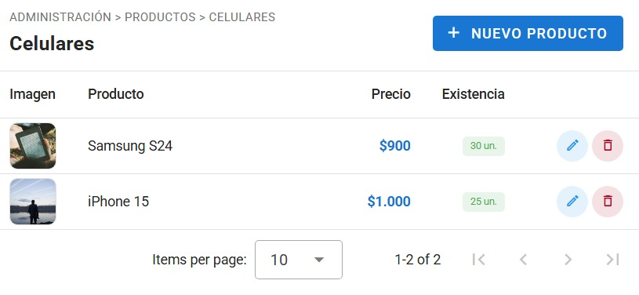
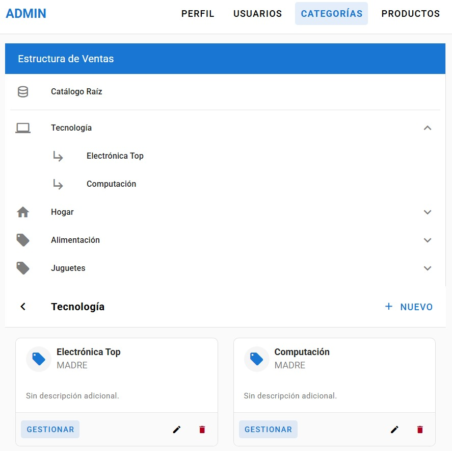
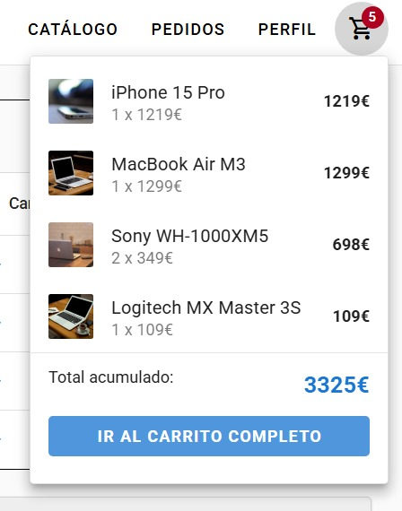

# 🛍️ Frontend - Vue 3 E-commerce Application

## 📋 Descripción General

Aplicación frontend moderna de e-commerce desarrollada con **Vue 3**, **Vuetify 3**, **TailwindCSS** y **Pinia** para la gestión de estado. El proyecto implementa un sistema completo de autenticación, gestión de productos, carrito de compras y administración de pedidos.






## 🚀 Stack Tecnológico

### Core Framework
- **Vue 3.5.24** - Framework progresivo de JavaScript con Composition API
- **TypeScript** - Tipado estático para mayor robustez
- **Vite 7.2.4** - Build tool ultra-rápido

### UI/UX
- **Vuetify 3.11.4** - Framework Material Design para Vue
- **TailwindCSS 4.1.18** - Framework CSS utility-first
- **@heroicons/vue** - Iconos SVG
- **@mdi/font** - Material Design Icons

### Estado y Routing
- **Pinia 3.0.4** - Store oficial de Vue (sucesor de Vuex)
- **Vue Router 4.6.4** - Enrutamiento SPA

### Utilidades
- **Zod 4.3.5** - Validación de schemas TypeScript-first
- **vuetify-confirm** - Diálogos de confirmación
- **@headlessui/vue** - Componentes UI sin estilos

## 📁 Estructura del Proyecto

```
front/
├── src/
│   ├── main.ts                 # Punto de entrada de la aplicación
│   ├── app/                    # Core de la aplicación
│   │   ├── router.ts           # Configuración de rutas
│   │   ├── store.ts            # Store principal (app state)
│   │   ├── menus.ts            # Configuración de menús
│   │   ├── tree.maps.ts        # Mapeo de rutas dinámicas
│   │   ├── ui.config.ts        # Configuración de UI por rol
│   │   ├── view.vue            # Layout principal
│   │   ├── auth/               # Módulo de autenticación
│   │   │   ├── login.vue
│   │   │   ├── register.vue
│   │   │   ├── reset.vue
│   │   │   ├── activate.vue
│   │   │   ├── store.ts        # Auth store (Pinia)
│   │   │   ├── api.ts          # Llamadas al backend
│   │   │   └── service.ts      # Lógica de negocio
│   │   ├── components/         # Componentes compartidos del app
│   │   │   ├── Layout.vue
│   │   │   ├── Navbar.vue
│   │   │   ├── Navigator.vue
│   │   │   └── MyEntityTable.vue
│   │   └── layout/             # Layouts por rol
│   │       ├── admin.vue
│   │       ├── user.vue
│   │       └── guest.vue
│   ├── modulos/                # Módulos de negocio
│   │   ├── adminProductos/     # Administración de productos
│   │   ├── carrito/            # Carrito de compras
│   │   ├── carro/              # Vista del carro (alternativa)
│   │   ├── categorias/         # Gestión de categorías
│   │   ├── productos/          # Catálogo de productos
│   │   ├── pedidos/            # Gestión de pedidos
│   │   ├── usuario/            # Perfil de usuario
│   │   └── contenido/          # Contenido estático (home)
│   ├── components/             # Componentes reutilizables globales
│   ├── contracts/              # Types e interfaces TypeScript
│   │   ├── index.ts
│   │   ├── models.ts
│   │   ├── dtos.ts
│   │   ├── user.ts
│   │   ├── cliente.ts
│   │   └── navigationItem.ts
│   ├── api/                    # Configuración de API
│   │   └── fetch.ts            # Cliente HTTP
│   ├── assets/                 # Recursos estáticos
│   │   ├── css/
│   │   └── images/
│   └── views/                  # Vistas principales
│       ├── Home.vue
│       ├── About.vue
│       ├── Dash.vue
│       └── UsuariosView.vue
├── public/                     # Archivos públicos
├── images/                     # Screenshots del proyecto
│   ├── snap0.jpeg
│   ├── snap1.jpeg
│   ├── snap2.jpeg
│   └── snap3.jpeg
├── vite.config.js             # Configuración de Vite
├── tailwind.config.js         # Configuración de TailwindCSS
├── tsconfig.json              # Configuración de TypeScript
└── package.json               # Dependencias del proyecto
```

## 🎯 Características Principales

### 🔐 Sistema de Autenticación
- Login y registro de usuarios
- Recuperación de contraseña
- Activación de cuenta por email
- Protección de rutas por roles (GUEST, USER, ADMIN)
- JWT token management

### 🛒 E-commerce
- **Catálogo de productos** con búsqueda y filtros
- **Carrito de compras** persistente
- **Gestión de categorías** jerárquica
- **Sistema de pedidos** completo
- **Panel de administración** para productos

### 🎨 UI/UX
- **Diseño responsive** con Vuetify y TailwindCSS
- **Temas claro/oscuro**
- **Navegación dinámica** basada en roles
- **Componentes reutilizables** (DataTables, EntityTables, etc.)
- **Confirmaciones** con diálogos modales

### 🏗️ Arquitectura
- **Modular** - Cada módulo es independiente con su store, api y vistas
- **Type-safe** - TypeScript + Zod para validaciones
- **Reactive** - Pinia para estado reactivo
- **Performante** - Lazy loading de rutas

## 🔧 Configuración

### Variables de Entorno
El archivo `vite.config.js` define:
```javascript
define: {
  __API_URL__: JSON.stringify('http://localhost:3000'),
}
```

### Alias de Path
```javascript
'@': './src'
'@auth': './src/app/auth'
'@modulos': './src/modulos'
'@componentes': './src/app/components'
'@app': './src/app'
```

## 🚦 Scripts Disponibles

```bash
# Desarrollo
npm run dev          # Inicia servidor de desarrollo (Vite)

# Producción
npm run build        # Construye para producción
npm run preview      # Previsualiza build de producción
```

## 📦 Instalación

```bash
# Instalar dependencias
npm install

# Iniciar servidor de desarrollo
npm run dev

# La aplicación estará disponible en http://localhost:5173
```

## 🔄 Flujo de Datos

1. **Bootstrap** (`main.ts`)
   - Crea instancia de Vue
   - Instala Pinia (state management)
   - Configura Vuetify (UI framework)
   - Inicializa Router
   - Carga estado de autenticación

2. **Autenticación** (`app/auth/`)
   - Usuario hace login
   - API retorna JWT token
   - Token se guarda en localStorage
   - Store de auth se actualiza
   - Router redirige según rol

3. **Navegación** (`app/router.ts`)
   - Guards verifican autenticación
   - Rutas dinámicas se cargan según rol
   - Lazy loading de componentes

4. **Módulos** (`modulos/`)
   - Cada módulo tiene su store (Pinia)
   - Services abstraen lógica de negocio
   - API calls centralizadas
   - Componentes reactivos a cambios de estado

## 🎭 Roles y Permisos

- **GUEST** - Usuario no autenticado (acceso a login/registro)
- **USER** - Usuario autenticado (catálogo, carrito, pedidos)
- **ADMIN** - Administrador (gestión completa de productos y usuarios)

## 🔌 Integración con Backend

El frontend consume una API REST desarrollada con:
- **Koa** (Node.js framework)
- **Prisma** (ORM)
- **PostgreSQL** (Base de datos)

Ver carpeta `/back` para más información del backend.

## 📸 Capturas de Pantalla

Las imágenes del proyecto están disponibles en la carpeta `/images`:
- `snap0.jpeg` - Vista principal
- `snap1.jpeg` - Catálogo de productos
- `snap2.jpeg` - Carrito de compras
- `snap3.jpeg` - Panel de administración

## 🛠️ Desarrollo

### Agregar un Nuevo Módulo

1. Crear carpeta en `src/modulos/nuevo-modulo/`
2. Estructura recomendada:
```
nuevo-modulo/
├── api.ts          # Llamadas HTTP
├── service.ts      # Lógica de negocio
├── store.ts        # Estado (Pinia)
├── types.ts        # TypeScript interfaces
├── routes.ts       # Rutas del módulo
└── vista.vue       # Componente principal
```

3. Registrar rutas en `app/tree.maps.ts`
4. Agregar al menú en `app/menus.ts`

### Estructura de un Store (Pinia)

```typescript
import { defineStore } from 'pinia'

export const useNuevoStore = defineStore('nuevo', {
  state: () => ({
    items: [],
    loading: false,
  }),
  
  actions: {
    async fetchItems() {
      this.loading = true
      // ... lógica
      this.loading = false
    }
  },
  
  getters: {
    itemCount: (state) => state.items.length
  }
})
```

## 🤝 Contribución

Este proyecto es parte de un fullstack completo. Para contribuir:
1. Revisar la estructura de módulos existentes
2. Seguir los patrones establecidos (store/service/api)
3. Mantener tipado TypeScript
4. Usar componentes reutilizables cuando sea posible

## 📄 Licencia

Proyecto privado de desarrollo.

---

**Desarrollado con ❤️ usando Vue 3 + Vuetify + TailwindCSS**