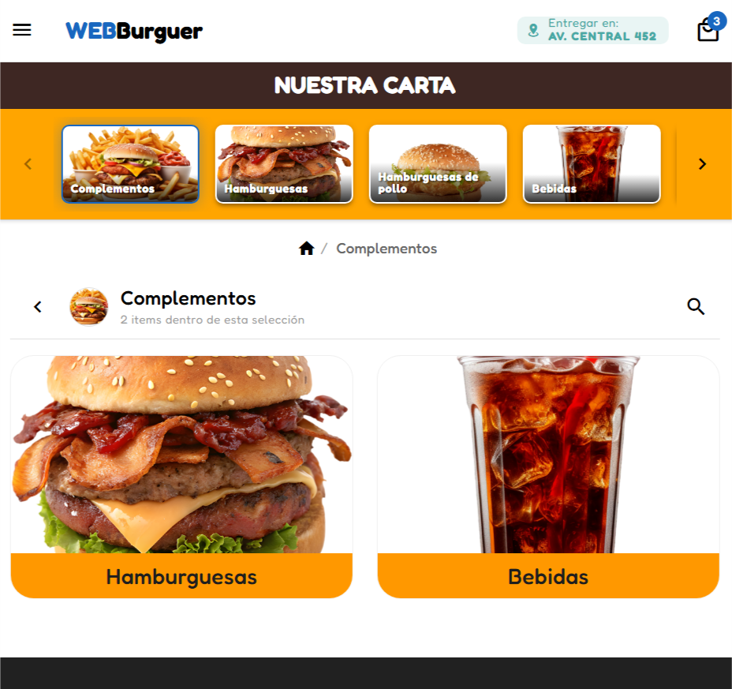
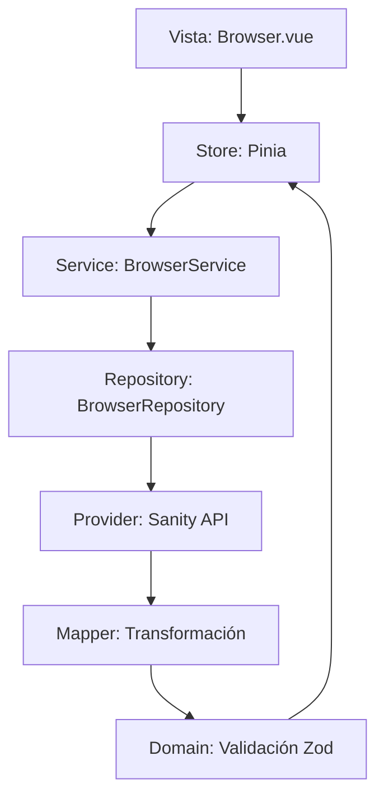

# WebBurguer - Sistema de Navegación de Catálogo

Aplicación web SPA desarrollada con **Vue 3 + TypeScript + Vuetify** que presenta un sistema de navegación jerárquico de productos consumiendo datos desde **Sanity CMS**. Implementa una arquitectura modular con validación de tipos mediante Zod, gestión de estado con Pinia y diseño Material Design.
---
## Screenshots



---

## 🚀 Stack Tecnológico

### Frontend Core
- **Vue 3.5** - Framework reactivo con Composition API
- **TypeScript 5.9** - Tipado estático end-to-end
- **Vite 8 (beta)** - Build tool ultrarrápido con HMR
- **Pug** - Template engine para componentes Vue

### UI Framework & Estilos
- **Vuetify 3.11** - Biblioteca de componentes Material Design
- **Material Design Icons (MDI)** - Sistema de iconografía
- **Headless UI** - Componentes accesibles sin estilos
- **Heroicons** - Iconos SVG complementarios
- **SASS** - Preprocesador CSS para estilos personalizados

### Gestión de Estado & Validación
- **Pinia 3.0** - State management oficial de Vue
- **Zod 4.3** - Validación de esquemas con inferencia de tipos

### Backend & Contenido
- **Sanity CMS** - Headless CMS para gestión de contenido
- **@sanity/client** - Cliente oficial para consultas GROQ
- **@sanity/image-url** - Transformación optimizada de imágenes

---

## 📐 Arquitectura del Sistema

El proyecto sigue una **arquitectura modular por dominios** con separación clara de responsabilidades:

```
src/
├─ modulos/
│  └─ navegador/                    # Módulo de navegación jerárquica
│     ├─ Browser.vue                # Componente principal (Vista)
│     ├─ domain.ts                  # Lógica de dominio + validación
│     ├─ service.ts                 # Capa de servicios
│     ├─ repository.ts              # Acceso a datos
│     ├─ store.ts                   # Estado global (Pinia)
│     ├─ zod.ts                     # Esquemas de validación
│     ├─ componentes/               # Componentes específicos
│     │  ├─ Card.vue                # Tarjeta de producto/categoría
│     │  ├─ Toolbar.vue             # Barra de herramientas
│     │  ├─ Breadcrumbs.vue         # Navegación de migas de pan
│     │  ├─ Shortcut.vue            # Accesos directos a categorías
│     │  └─ Search.vue              # Buscador
│     └─ provider/
│        └─ sanity/                 # Integración con Sanity CMS
│           ├─ api.ts               # Cliente Sanity configurado
│           ├─ queries.ts           # Consultas GROQ
│           ├─ mapper.ts            # Transformación de datos
│           └─ zod.ts               # Validación de respuestas
├─ componentes/
│  ├─ Navbar.vue                    # Barra de navegación global
│  └─ Footer.vue                    # Pie de página
├─ styles/
│  └─ settings.scss                 # Variables y estilos globales
└─ utils/                           # Utilidades compartidas
```

### Flujo de Datos (Capas)



**1. Vista (Browser.vue)**
- Componente principal que orquesta la UI
- Renderiza toolbar, breadcrumbs, grid de tarjetas y shortcuts
- Maneja transiciones y estados de carga

**2. Store (Pinia)**
- Estado global: items, navegación, búsqueda
- Getters computados: filtrado, breadcrumbs, categorías
- Actions: inicialización, selección, navegación

**3. Service**
- Coordina el flujo entre Repository y Domain
- Aplica lógica de negocio adicional

**4. Repository**
- Abstracción del proveedor de datos (Sanity)
- Punto único de acceso a datos externos

**5. Provider (Sanity)**
- Ejecuta consultas GROQ al CMS
- Transforma respuestas al formato esperado
- Maneja URLs de imágenes optimizadas

**6. Domain**
- Valida la integridad de los datos con Zod
- Asegura tipado estricto del árbol de navegación

---

## 🗂️ Modelo de Datos

### Esquema de Item de Navegación

```typescript
interface ItemBrowserType {
  id: string;
  nombre: string;
  slug: string;
  imagenUrl: string;
  nivel: 'familia' | 'madre' | 'hija' | 'producto';
  precio?: number;           // Solo para productos
  hijos: ItemBrowserType[];  // Estructura recursiva
}
```

### Jerarquía de Niveles

- **Familia**: Categoría raíz (ej: "Hamburguesas")
- **Madre**: Subcategoría (ej: "Clásicas")
- **Hija**: Subcategoría terciaria (ej: "Con Queso")
- **Producto**: Elemento final con precio

### Validaciones con Zod

- Los **productos** deben tener precio
- Las **categorías** NO pueden tener precio
- Todos los campos obligatorios validados
- URLs de imagen verificadas
- Estructura recursiva de `hijos` validada

---

## ✨ Características Principales

### 1. Navegación Jerárquica
- Exploración de categorías multinivel
- Breadcrumbs dinámicos para rastrear ubicación
- Navegación "hacia atrás" con historial de ruta

### 2. Búsqueda Global Recursiva
- Búsqueda en tiempo real sobre todo el árbol
- Filtra productos y categorías simultáneamente
- Limpieza rápida de resultados

### 3. Accesos Directos (Shortcuts)
- Panel horizontal con todas las categorías
- Salto directo a cualquier nivel jerárquico
- Indicador visual de categoría activa

### 4. Tarjetas Adaptativas
- Diseño diferenciado para categorías vs productos
- Precios sobre imagen (solo productos)
- Hover states y efectos de elevación
- Grid responsive (1-4 columnas según viewport)

### 5. Gestión de Estado
- Carga diferida de datos
- Skeleton loaders durante carga inicial
- Estado empty con call-to-action
- Transiciones fluidas entre vistas

---

## 🛠️ Instalación y Desarrollo

### Requisitos Previos
- Node.js 18+ y npm 8+
- Cuenta en Sanity.io (opcional para desarrollo local)

### Setup Rápido

```powershell
# Instalar dependencias
npm install

# Modo desarrollo (http://localhost:5173)
npm run dev

# Build para producción
npm run build

# Preview de build
npm run preview
```

### Configuración de Sanity

El proyecto está conectado al proyecto Sanity con ID: `a0j5vi5q`

Si necesitas conectar tu propio CMS:

1. Edita `src/modulos/navegador/provider/sanity/api.ts`:
```typescript
export const sanityClient = createClient({
  projectId: 'TU_PROJECT_ID',
  dataset: 'production',
  useCdn: true,
  apiVersion: '2024-03-01',
})
```

2. Asegúrate de tener el siguiente esquema en Sanity:
   - Type: `categoria` con campos: `nombre`, `slug`, `icono`, `categoriaPadre`, `tipo`
   - Type: `producto` con campos: `nombre`, `slug`, `precio`, `imagenes`, `categoria`

---

## 📦 Scripts Disponibles

| Script | Descripción |
|--------|-------------|
| `npm run dev` | Inicia servidor de desarrollo con HMR |
| `npm run build` | Compila TypeScript y genera build optimizado |
| `npm run preview` | Sirve el build localmente para testing |

---

## 🎨 Componentes Destacados

### Browser.vue (Vista Principal)
- Orquestador del módulo navegador
- Maneja shortcuts, toolbar, breadcrumbs y grid
- Sistema de transiciones con `v-fade-transition`
- Estados: loading, empty, content

### Card.vue (Tarjeta Universal)
- Renderiza categorías y productos con diseño adaptativo
- Precio flotante sobre imagen (solo productos)
- Click handler para navegación (categorías)
- Botón "Añadir al carrito" (productos)

### Shortcut.vue (Panel de Accesos)
- Navegación horizontal con scroll
- Destacado visual de categoría activa
- Iconos MDI + nombres de categoría

### Toolbar.vue (Barra de Herramientas)
- Título dinámico según navegación
- Buscador con debounce
- Botón "volver" condicional

### Breadcrumbs.vue (Migas de Pan)
- Ruta completa desde raíz hasta item actual
- Links clicables para navegación rápida
- Auto-oculta en vista raíz

---

## 🔍 Consultas GROQ (Sanity)

Ejemplo de consulta jerárquica:

```groq
*[_type == "categoria" && tipo == "FAMILIA"] {
  _id,
  nombre,
  "slug": slug.current,
  "imagen": icono,
  "hijos": *[_type == "categoria" && categoriaPadre._ref == ^._id] {
    _id,
    nombre,
    "slug": slug.current,
    "imagen": icono,
    "hijos": *[_type == "categoria" && categoriaPadre._ref == ^._id] {
      _id,
      nombre,
      "slug": slug.current,
      "imagen": icono,
      "productos": *[_type == "producto" && categoria._ref == ^._id] {
        _id,
        nombre,
        precio,
        "slug": slug.current,
        "imagen": imagenes[principal == true][0]
      }
    }
  }
}
```

---

## 🎯 Casos de Uso

1. **Exploración de Catálogo**: Usuario navega visualmente por categorías
2. **Búsqueda Rápida**: Usuario busca "hamburguesa" y ve todos los resultados
3. **Navegación Directa**: Usuario usa shortcuts para saltar a "Bebidas"
4. **Añadir al Carrito**: Usuario clickea precio en tarjeta de producto
5. **Navegación Histórica**: Usuario retrocede con breadcrumbs

---

## 📱 Responsive Design

- **Mobile (< 768px)**: 1 columna, menú hamburguesa
- **Tablet (768-1024px)**: 2-3 columnas
- **Desktop (> 1024px)**: 4 columnas, navegación completa
- **Max-width contenedor**: 1200px centrado

---

## 🔐 Type Safety

Todo el flujo de datos está tipado:

1. **Sanity Response** → validado con Zod en `provider/sanity/zod.ts`
2. **Mapper Output** → tipado con `ItemBrowserType`
3. **Domain** → valida recursivamente con `ItemBrowserArraySchema`
4. **Store** → state y getters totalmente tipados
5. **Components** → props y emits con inferencia TypeScript

---

## 🚧 Mejoras Futuras

- [ ] Carrito de compras funcional
- [ ] Filtros avanzados (precio, disponibilidad)
- [ ] Paginación/scroll infinito para catálogos grandes
- [ ] Favoritos/Wishlist persistente
- [ ] Integración con sistema de pagos
- [ ] Modo offline con Service Workers
- [ ] Multi-idioma (i18n)
- [ ] Analytics de navegación

---

## 👤 Autor

**Martin Miguel Galarza Continanza**
- Email: mmgalarza@gmail.com
- GitHub: https://github.com/mmgalarza

---

## 📄 Licencia

Proyecto privado - Todos los derechos reservados

---

## 🙏 Agradecimientos

- **Vuetify Team** por el framework Material Design
- **Sanity.io** por el headless CMS robusto
- **Vue Core Team** por la excelente DX de Vue 3
